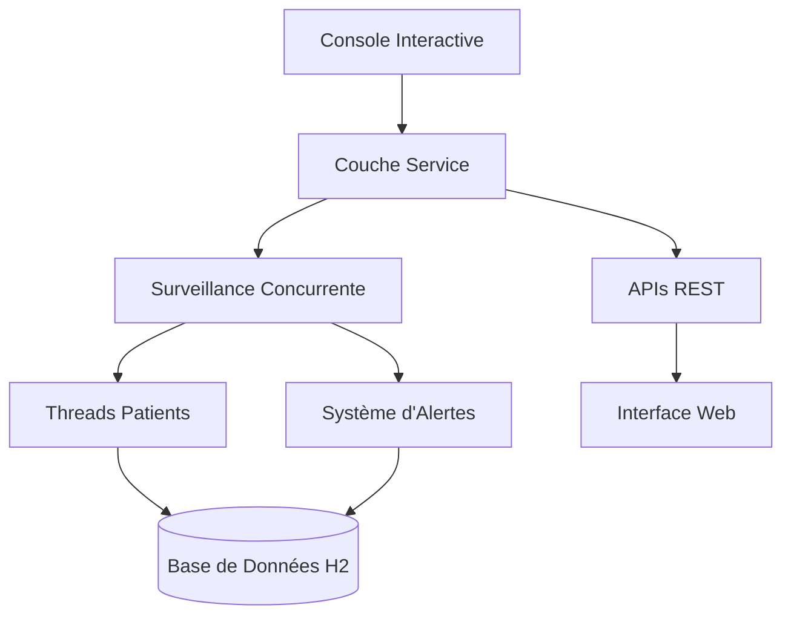

# 🏥 Medical Monitoring System
> Système de Surveillance Médicale en Temps Réel avec Programmation Concurrente

[](https://openjdk.org/projects/jdk/17/)
[](https://spring.io/projects/spring-boot)
[](https://maven.apache.org/)
[](#)

## 👥 Équipe de Développement

| **Étudiantes** | **Formation** | **Institution** |
|----------------|---------------|-----------------|
| 👩‍💻 **Houda Belhad** | Master Ingénierie de Développement Logiciel et Décisionnel | FSR - Université Mohammed V - Rabat, Maroc |
| 👩‍💻 **Salma Boughanja** | Master Ingénierie de Développement Logiciel et Décisionnel | FSR - Université Mohammed V - Rabat, Maroc |

**📚 Module :** Programmation Concurrente  
**👨‍🏫 Encadrant :** Mr. Ouacha Ali  

---

## 🚀 Quick Start

```bash
# Clone the repository
git clone https://github.com/[username]/medical-monitoring-system.git
cd medical-monitoring-system

# Build and run
mvn clean install
mvn spring-boot:run

# Access the interactive console
medical-monitor> help
```

## 📖 Table of Contents

- [📋 Project Overview](#-project-overview)
- [🔧 Concurrent Programming Features](#-concurrent-programming-features)
- [🏗️ Architecture](#️-architecture)
- [🚀 Installation](#-installation)
- [📖 Usage Guide](#-usage-guide)
- [🌐 REST APIs](#-rest-apis)
- [🚧 Current Status](#-current-status)
- [🧪 Testing](#-testing)
- [🤝 Contributing](#-contributing)

---

## 📋 Project Overview

Un **système de surveillance médicale en temps réel** développé avec Spring Boot, mettant en œuvre les concepts de programmation concurrente pour la surveillance des signes vitaux des patients.

### 🎯 Fonctionnalités Clés

- 👥 **Surveillance multi-patients** avec threads concurrents
- ⚡ **Simulation de données en temps réel** (température, fréquence cardiaque, tension artérielle)
- 🚨 **Système d'alertes automatisé** avec seuils configurables
- 🖥️ **Interface console interactive** pour la gestion du système
- 🌐 **APIs RESTful** pour l'intégration externe
- 📊 **Traitement asynchrone des données**

### 🏆 Objectifs Pédagogiques

Ce projet démontre l'implémentation pratique de :
- **Multi-threading** et **exécution concurrente**
- **Synchronisation des threads** et **cohérence des données**
- **Programmation asynchrone** avec Spring Boot
- **Architecture de surveillance temps réel**

---

## 🔧 Concurrent Programming Features

Ce projet met en valeur des concepts avancés de programmation concurrente implémentés avec **Spring Boot** :

### 🧵 Architecture Multi-Threading
```java
// Thread dédié par simulateur de capteur patient
@Service
public class SensorSimulatorService {
    private final ScheduledExecutorService executorService = 
        Executors.newScheduledThreadPool(10);
    
    @Async
    public CompletableFuture<Void> startPatientMonitoring(Long patientId) {
        // Implémentation de surveillance asynchrone
    }
}
```

### ⚙️ Fonctionnalités Concurrentes Principales

| Fonctionnalité | Implémentation | Bénéfice |
|----------------|----------------|----------|
| **🔄 Exécution Asynchrone** | `@Async`, `CompletableFuture` | Opérations non-bloquantes |
| **⏰ Tâches Planifiées** | `@Scheduled`, `ScheduledExecutorService` | Génération périodique de données |
| **🔒 Thread Safety** | `ConcurrentHashMap`, méthodes synchronisées | Cohérence des données |
| **🚀 Traitement Parallèle** | Pools de threads, collections concurrentes | Optimisation des performances |

### 📊 Patterns de Concurrence Utilisés

- **Producteur-Consommateur** : Génération de données capteur → Traitement d'alertes
- **Pattern Observer** : Mises à jour temps réel → Notifications console  
- **Gestion de Pool de Threads** : Utilisation optimisée des ressources
- **Programmation Lock-Free** : ConcurrentHashMap pour l'état partagé

---

## 🏗️ Architecture



### 🗂️ Structure du Projet
```
src/
├── 📁 main/java/
│   ├── 🎮 controllers/     # Contrôleurs REST
│   ├── ⚙️  services/        # Logique métier + Concurrence
│   ├── 📊 models/          # Entités JPA
│   ├── 🖥️  console/        # Console Interactive
│   └── ⚙️  config/         # Configuration Spring
├── 📁 main/resources/
│   ├── 🎨 templates/       # Vues Thymeleaf
│   ├── 📄 static/          # Assets Web
│   └── ⚙️  application.yml # Configuration App
└── 🧪 test/               # Tests Unitaires
```

---

## 🚀 Installation

### Prérequis
- ☕ **Java 17+**
- 📦 **Maven 3.6+**
- 🔌 **Port 8080** disponible

### Installation
```bash
# 1. Cloner le repository
git clone https://github.com/[username]/medical-monitoring-system.git
cd medical-monitoring-system

# 2. Construire le projet
mvn clean install

# 3. Lancer l'application
mvn spring-boot:run
# OU
java -jar target/medical-monitoring-0.0.1-SNAPSHOT.jar
```

### Points d'Accès
- 🖥️  **Console Interactive** : Démarre automatiquement dans le terminal
- 🌐 **Interface Web** : http://localhost:8080 *(en développement)*
- 📡 **APIs REST** : http://localhost:8080/api/

---

## 📖 Usage Guide

### 🖥️ Console Interactive

Le système démarre avec une console interactive pour la gestion temps réel :

```bash
🚀 Interface console démarrée
💡 Tapez 'help' pour voir les commandes disponibles
🔇 Mode silencieux activé par défaut (utilisez 'debug on' pour voir les détails)

medical-monitor> 
```

### 🏥 Commandes Principales

<details>
<summary>👥 <strong>Gestion des Patients</strong></summary>

```bash
# Ajouter un nouveau patient
medical-monitor> add-patient Dupont Jean
✅ Patient ajouté avec succès: Jean Dupont (ID: 1)

# Lister tous les patients  
medical-monitor> list-patients
👥 LISTE DES PATIENTS:
─────────────────────────────────────────
ID: 1 | Jean Dupont
ID: 2 | Sophie Martin
```
</details>

<details>
<summary>📊 <strong>Surveillance des Signes Vitaux</strong></summary>

```bash
# Démarrer la surveillance d'un patient
medical-monitor> start-monitoring 1
🔍 Surveillance démarrée pour Jean Dupont (ID: 1)

# Voir les données en temps réel
medical-monitor> show-data 1
📊 DONNÉES CAPTEUR - Jean Dupont
─────────────────────────────────────────────────────
🌡️  Température: 36.8°C
❤️  Fréquence cardiaque: 72 bpm
🩸 Pression artérielle: 120/80 mmHg
⏰ Timestamp: 15/06/2025 14:30:45

# Mode surveillance live
medical-monitor> monitor-live 1
🔴 SURVEILLANCE EN TEMPS RÉEL - Jean Dupont
Appuyez sur ENTRÉE pour arrêter...
# Mises à jour toutes les 2 secondes
```
</details>

<details>
<summary>🚨 <strong>Gestion des Alertes</strong></summary>

```bash  
# Voir les alertes actives
medical-monitor> show-alerts
🚨 ALERTES ACTIVES (2):
─────────────────────────────────────────────────────
🚨 [ID:1] Patient 1 - TEMPERATURE: 38.2 (seuil franchi: 37.5) - 15/06 14:32:15
🚨 [ID:2] Patient 2 - HEART_RATE: 45 (seuil franchi: 60.0) - 15/06 14:32:18

# Acquitter une alerte spécifique
medical-monitor> ack-alert 1
✅ Alerte ID 1 acquittée

# Acquitter toutes les alertes d'un patient
medical-monitor> ack-patient-alerts 2
✅ Toutes les alertes du patient ID 2 ont été acquittées
```
</details>

### ⚙️ Commandes Système
```bash
medical-monitor> help           # Afficher toutes les commandes
medical-monitor> status         # Vue d'ensemble du système
medical-monitor> debug on       # Activer le mode debug
medical-monitor> pause-all      # Suspendre toute surveillance
medical-monitor> resume-all     # Reprendre toute surveillance  
medical-monitor> exit           # Quitter l'application
```

### 🎯 Seuils d'Alerte
- **🌡️ Température** : < 36.0°C ou > 37.5°C
- **❤️ Fréquence Cardiaque** : < 60 bpm ou > 100 bpm  
- **🩸 Pression Artérielle** : > 140 mmHg (systolique)

---

## 🌐 REST APIs

**Statut : ✅ Entièrement Fonctionnelles** - Tous les endpoints supportent les opérations asynchrones

### 📋 Documentation API

<details>
<summary>👥 <strong>Endpoints Patients</strong></summary>

```http
GET    /api/patients              # Lister tous les patients
POST   /api/patients              # Ajouter nouveau patient  
GET    /api/patients/{id}         # Détails d'un patient
DELETE /api/patients/{id}         # Supprimer un patient
```

**Exemple d'utilisation :**
```bash
# Ajouter un patient
curl -X POST http://localhost:8080/api/patients \
  -H "Content-Type: application/json" \
  -d '{"firstName":"Jean","lastName":"Dupont"}'

# Obtenir tous les patients  
curl http://localhost:8080/api/patients
```
</details>

<details>
<summary>📊 <strong>Endpoints Surveillance</strong></summary>

```http
POST   /api/monitoring/start/{id} # Démarrer surveillance patient
POST   /api/monitoring/stop/{id}  # Arrêter surveillance patient  
GET    /api/monitoring/data/{id}  # Obtenir signes vitaux patient
GET    /api/monitoring/status     # Obtenir statut système
```

**Exemple d'utilisation :**
```bash
# Démarrer surveillance
curl -X POST http://localhost:8080/api/monitoring/start/1

# Obtenir données temps réel
curl http://localhost:8080/api/monitoring/data/1
```
</details>

<details>
<summary>🚨 <strong>Endpoints Alertes</strong></summary>

```http
GET    /api/alerts                # Obtenir toutes les alertes
POST   /api/alerts/{id}/ack       # Acquitter une alerte
GET    /api/alerts/patient/{id}   # Obtenir alertes d'un patient
GET    /api/alerts/active         # Obtenir alertes actives uniquement
```

**Exemple d'utilisation :**
```bash
# Obtenir alertes actives
curl http://localhost:8080/api/alerts/active

# Acquitter une alerte
curl -X POST http://localhost:8080/api/alerts/1/ack
```
</details>

### 📱 Format de Réponse
```json
{
  "success": true,
  "timestamp": "2025-06-15T14:30:45",
  "data": {
    "patientId": 1,
    "temperature": 36.8,
    "heartRate": 72,
    "bloodPressure": "120/80"
  }
}
```

---

## 🚧 Current Status & Roadmap

### ✅ Fonctionnalités Terminées

| Composant | Statut | Détails |
|-----------|--------|---------|
| 🖥️ **Console Interactive** | ✅ **100% Fonctionnelle** | Toutes les commandes opérationnelles |
| 📡 **APIs REST** | ✅ **100% Fonctionnelles** | Tous les endpoints avec support async |
| 🧵 **Surveillance Concurrente** | ✅ **100% Fonctionnelle** | Surveillance multi-threads des patients |
| 🚨 **Système d'Alertes** | ✅ **100% Fonctionnel** | Alertes temps réel avec acquittement |
| 💾 **Persistance Données** | ✅ **100% Fonctionnelle** | Intégration base de données H2 |

### 🔄 En Cours de Développement

#### 🎨 **Interface Web (Thymeleaf)**
**Problème Actuel :** L'affichage asynchrone dans le navigateur nécessite des corrections

**Solutions Prévues :**
```html
<!-- Intégration WebSocket -->
<script>
const socket = new SockJS('/websocket');
const stompClient = Stomp.over(socket);

stompClient.connect({}, function(frame) {
    stompClient.subscribe('/topic/alerts', function(alert) {
        updateAlertDisplay(JSON.parse(alert.body));
    });
});
</script>

<!-- Auto-refresh avec AJAX -->
<script>
setInterval(() => {
    fetch(`/api/monitoring/data/${patientId}`)
        .then(response => response.json())
        .then(data => updateVitalSigns(data));
}, 3000);
</script>
```

### 🚀 Améliorations Futures

- **📡 Intégration WebSocket** : Communication bidirectionnelle temps réel
- **📊 Dashboard Dynamique** : Graphiques et diagrammes en direct  
- **⚡ Server-Sent Events** : Notifications push pour les alertes
- **🔄 Programmation Réactive** : Migration vers Spring WebFlux
- **📱 UI Responsive Mobile** : Meilleure expérience mobile
- **🔔 Notifications Email** : Système d'alertes par email

### 🐛 Problèmes Connus

1. **Mises à jour Frontend Async** : Les pages Thymeleaf ne se rafraîchissent pas automatiquement
2. **Configuration WebSocket** : Nécessite configuration pour mises à jour web temps réel
3. **Rendu des Graphiques** : Implémentation des graphiques dynamiques en attente

### 💡 Améliorations Techniques Prévues

```java
// Configuration WebSocket
@Configuration
@EnableWebSocket  
public class WebSocketConfig implements WebSocketConfigurer {
    
    @Override
    public void registerWebSocketHandlers(WebSocketHandlerRegistry registry) {
        registry.addHandler(new AlertWebSocketHandler(), "/alerts")
                .setAllowedOrigins("*");
    }
}

// Contrôleur Server-Sent Events
@GetMapping(value = "/stream/alerts", produces = MediaType.TEXT_EVENT_STREAM_VALUE)
public Flux<ServerSentEvent<Alert>> streamAlerts() {
    return alertService.getAlertStream()
            .map(alert -> ServerSentEvent.builder(alert).build());
}
```

---

## 🧪 Testing

### Test Rapide (5 minutes)
```bash
# Ajouter un patient de test
medical-monitor> add-patient Test Patient

# Démarrer surveillance  
medical-monitor> start-monitoring 1

# Attendre 30 secondes, puis vérifier données
medical-monitor> show-data 1

# Vérifier les alertes
medical-monitor> show-alerts
```

### Suite de Tests Complète (10 minutes)
```bash
# 1. Ajouter plusieurs patients
medical-monitor> add-patient Dupont Jean
medical-monitor> add-patient Martin Sophie  
medical-monitor> add-patient Dubois Pierre

# 2. Démarrer surveillance pour tous
medical-monitor> start-monitoring 1
medical-monitor> start-monitoring 2
medical-monitor> start-monitoring 3

# 3. Démonstration surveillance live
medical-monitor> monitor-live 1
# Appuyer sur ENTRÉE après quelques secondes

# 4. Vérifier données de tous les patients
medical-monitor> show-data 1
medical-monitor> show-data 2
medical-monitor> show-data 3

# 5. Attendre les alertes (1-2 minutes)
medical-monitor> show-alerts

# 6. Acquitter les alertes
medical-monitor> ack-alert [ALERT_ID]
medical-monitor> ack-patient-alerts [PATIENT_ID]

# 7. Statut final du système
medical-monitor> status
```

### 🎯 Critères de Réussite

- ✅ **Patients Ajoutés** : IDs assignés, visibles dans la liste
- ✅ **Surveillance Active** : Le statut montre les simulateurs actifs  
- ✅ **Données Générées** : `show-data` affiche les valeurs récentes
- ✅ **Alertes Déclenchées** : `show-alerts` montre les alertes actives
- ✅ **Acquittement Fonctionne** : Les alertes passent au statut "ACQUITTÉE"
- ✅ **Surveillance Continue** : Nouvelles données toutes les 3 secondes

---

## 🤝 Contributing

### Configuration Développement
```bash
# Fork et cloner le repository
git clone https://github.com/[your-username]/medical-monitoring-system.git

# Créer une branche feature
git checkout -b feature/your-feature-name

# Effectuer les modifications et commit
git commit -am "Add your feature"

# Push vers votre fork et soumettre une pull request
git push origin feature/your-feature-name
```

### 📋 Guidelines de Développement

1. **Programmation Concurrente** : Suivre les bonnes pratiques de thread-safety
2. **Style de Code** : Utiliser un formatage cohérent et des noms significatifs
3. **Tests** : Ajouter des tests unitaires pour les nouvelles fonctionnalités
4. **Documentation** : Mettre à jour le README pour les changements significatifs

### 🎓 Contexte Académique

Ce projet est développé dans le cadre du cours de **Programmation Concurrente** à la **FSR - Université Mohammed V, Rabat**. Il démontre l'implémentation pratique de :

- Concepts de multi-threading
- Mécanismes de synchronisation  
- Programmation asynchrone
- Design de systèmes temps réel

**Enseignant** : Mr. Ouacha Ali  
**Étudiantes** : Houda Belhad & Salma Boughanja

---

## 📄 License

Ce projet est développé à des fins académiques dans le cadre du programme de Master en **Ingénierie de Développement Logiciel et Décisionnel** à la FSR - Université Mohammed V, Rabat.

---

## 📞 Contact

👩‍💻 **Houda Belhad** - [GitHub Profile]  
👩‍💻 **Salma Boughanja** - [GitHub Profile]

🏫 **Institution** : Faculté des Sciences, Université Mohammed V, Rabat  
📧 **Contact Académique** : [Informations de contact]

---

<div align="center">

**⭐ Mettez une étoile à ce repo si vous le trouvez utile !**

Fait avec ❤️ pour apprendre la programmation concurrente

</div>
