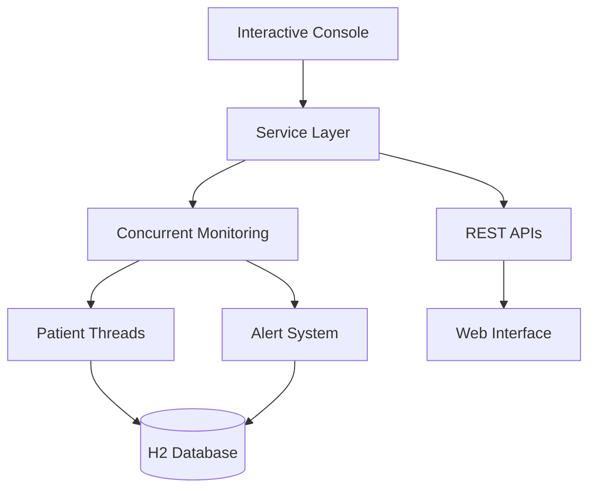

# 🏥 Medical Monitoring System
> Système de Surveillance Médicale en Temps Réel avec Programmation Concurrente

[](https://openjdk.java.net/)
[](https://spring.io/projects/spring-boot)
[](https://maven.apache.org/)
[](#)

## 👥 Équipe de Développement

| **Étudiantes** | **Formation** | **Institution** |
|## 🚀 Quick Start

```bash
# Clone the repository
git clone https://github.com/[username]/medical-monitoring-system.git
cd medical-monitoring-system

# Build and run
mvn clean install
mvn spring-boot:run

# Access the interactive console
medical-monitor> help
```

## 📖 Table of Contents

- [📋 Project Overview](#-project-overview)
- [🔧 Concurrent Programming Features](#-concurrent-programming-features)
- [🏗️ Architecture](#️-architecture)
- [🚀 Installation](#-installation)
- [📖 Usage Guide](#-usage-guide)
- [🌐 REST APIs](#-rest-apis)
- [🚧 Current Status](#-current-status)
- [🤝 Contributing](#-contributing)|
- [🏗️ Architecture](#-architecture)| 



### 🗂️ Project Structure
```
src/
├── 📁 main/java/
│   ├── 🎮 controllers/     # REST Controllers
│   ├── ⚙️  services/        # Business Logic + Concurrency
│   ├── 📊 models/          # JPA Entities
│   ├── 🖥️  console/        # Interactive Console
│   └── ⚙️  config/         # Spring Configuration
├── 📁 main/resources/
│   ├── 🎨 templates/       # Thymeleaf Views
│   ├── 📄 static/          # Web Assets
│   └── ⚙️  application.yml # App Configuration
└── 🧪 test/               # Unit Tests
```

| 👩‍💻 **Houda Belhad** | Master Ingénierie de Développement | FSR - Université Mohammed V |
| 👩‍💻 **Salma Boughanja** | Logiciel et Décisionnel | Rabat, Maroc |

**📚 Module :** Programmation Concurrente  
**👨‍🏫 Encadrant :** Mr. Ouacha Ali  

---

## 📋 Project Overview

A **real-time medical monitoring system** built with Spring Boot, featuring concurrent programming concepts for patient vital signs surveillance.

### 🎯 Key Features

- 👥 **Multi-patient monitoring** with concurrent threads
- ⚡ **Real-time data simulation** (temperature, heart rate, blood pressure)
- 🚨 **Automated alert system** with configurable thresholds
- 🖥️ **Interactive console interface** for system management
- 🌐 **RESTful APIs** for external integration
- 📊 **Asynchronous data processing**

### 🏆 Learning Objectives

This project demonstrates practical implementation of:
- **Multi-threading** and **concurrent execution**
- **Thread synchronization** and **data consistency**
- **Asynchronous programming** with Spring Boot
- **Real-time monitoring** architecture

---

## 🔧 Concurrent Programming Features

This project showcases advanced concurrent programming concepts implemented with **Spring Boot**:

### 🧵 Multi-Threading Architecture
```java
// Dedicated thread per patient sensor simulator
@Service
public class SensorSimulatorService {
    private final ScheduledExecutorService executorService = 
        Executors.newScheduledThreadPool(10);
    
    @Async
    public CompletableFuture<Void> startPatientMonitoring(Long patientId) {
        // Asynchronous monitoring implementation
    }
}
```

### ⚙️ Core Concurrent Features

| Feature | Implementation | Benefit |
|---------|----------------|---------|
| **🔄 Asynchronous Execution** | `@Async`, `CompletableFuture` | Non-blocking operations |
| **⏰ Scheduled Tasks** | `@Scheduled`, `ScheduledExecutorService` | Periodic data generation |
| **🔒 Thread Safety** | `ConcurrentHashMap`, Synchronized methods | Data consistency |
| **🚀 Parallel Processing** | Thread pools, Concurrent collections | Performance optimization |

### 📊 Concurrency Patterns Used

- **Producer-Consumer**: Sensor data generation → Alert processing
- **Observer Pattern**: Real-time data updates → Console notifications  
- **Thread Pool Management**: Optimized resource utilization
- **Lock-Free Programming**: ConcurrentHashMap for shared state

---

## 🚀 Installation

### Prerequisites
- ☕ **Java 11+**
- 📦 **Maven 3.6+**
- 🔌 **Port 8080** available

### Setup
```bash
# 1. Clone repository
git clone https://github.com/[username]/medical-monitoring-system.git
cd medical-monitoring-system

# 2. Build project
mvn clean install

# 3. Run application
mvn spring-boot:run
# OR
java -jar target/medical-monitoring-0.0.1-SNAPSHOT.jar
```

### Access Points
- 🖥️  **Interactive Console**: Starts automatically in terminal
- 🌐 **Web Interface**: http://localhost:8080 *(in development)*
- 📡 **REST APIs**: http://localhost:8080/api/

---

## 📖 Usage Guide

### 🖥️ Interactive Console

The system starts with an interactive console for real-time management:

```bash
🚀 Medical Monitoring System Started
💡 Type 'help' to see available commands
🔇 Silent mode enabled (use 'debug on' for details)

medical-monitor> 
```

### 🏥 Core Commands

<details>
<summary>👥 <strong>Patient Management</strong></summary>

```bash
# Add a new patient
medical-monitor> add-patient Dupont Jean
✅ Patient added successfully: Jean Dupont (ID: 1)

# List all patients  
medical-monitor> list-patients
👥 PATIENT LIST:
─────────────────────────────────────────
ID: 1 | Jean Dupont
ID: 2 | Sophie Martin
```
</details>

<details>
<summary>📊 <strong>Vital Signs Monitoring</strong></summary>

```bash
# Start monitoring a patient
medical-monitor> start-monitoring 1
🔍 Monitoring started for Jean Dupont (ID: 1)

# View real-time data
medical-monitor> show-data 1
📊 SENSOR DATA - Jean Dupont
─────────────────────────────────────────
🌡️  Temperature: 36.8°C
❤️  Heart Rate: 72 bpm  
🩸 Blood Pressure: 120/80 mmHg
⏰ Timestamp: 15/06/2025 14:30:45

# Live monitoring mode
medical-monitor> monitor-live 1
🔴 LIVE MONITORING - Jean Dupont
Press ENTER to stop...
# Updates every 2 seconds
```
</details>

<details>
<summary>🚨 <strong>Alert Management</strong></summary>

```bash  
# View active alerts
medical-monitor> show-alerts
🚨 ACTIVE ALERTS (2):
─────────────────────────────────────────
🚨 [ID:1] Patient 1 - TEMPERATURE: 38.2°C (threshold: 37.5°C)
🚨 [ID:2] Patient 2 - HEART_RATE: 45 bpm (threshold: 60.0 bpm)

# Acknowledge specific alert
medical-monitor> ack-alert 1
✅ Alert ID 1 acknowledged

# Acknowledge all alerts for a patient
medical-monitor> ack-patient-alerts 2
✅ All alerts for patient ID 2 acknowledged
```
</details>

### ⚙️ System Commands
```bash
medical-monitor> help           # Show all commands
medical-monitor> status         # System overview
medical-monitor> debug on       # Enable debug mode
medical-monitor> pause-all      # Pause all monitoring
medical-monitor> resume-all     # Resume all monitoring  
medical-monitor> exit           # Quit application
```

### 🎯 Alert Thresholds
- **🌡️ Temperature**: < 36.0°C or > 37.5°C
- **❤️ Heart Rate**: < 60 bpm or > 100 bpm  
- **🩸 Blood Pressure**: > 140 mmHg (systolic)

---

## 🌐 REST APIs

**Status: ✅ Fully Functional** - All endpoints support asynchronous operations

### 📋 API Documentation

<details>
<summary>👥 <strong>Patient Endpoints</strong></summary>

```http
GET    /api/patients              # List all patients
POST   /api/patients              # Add new patient  
GET    /api/patients/{id}         # Get patient details
DELETE /api/patients/{id}         # Delete patient
```

**Example Usage:**
```bash
# Add patient
curl -X POST http://localhost:8080/api/patients \
  -H "Content-Type: application/json" \
  -d '{"firstName":"Jean","lastName":"Dupont"}'

# Get all patients  
curl http://localhost:8080/api/patients
```
</details>

<details>
<summary>📊 <strong>Monitoring Endpoints</strong></summary>

```http
POST   /api/monitoring/start/{id} # Start patient monitoring
POST   /api/monitoring/stop/{id}  # Stop patient monitoring  
GET    /api/monitoring/data/{id}  # Get patient vital signs
GET    /api/monitoring/status     # Get system status
```

**Example Usage:**
```bash
# Start monitoring
curl -X POST http://localhost:8080/api/monitoring/start/1

# Get real-time data
curl http://localhost:8080/api/monitoring/data/1
```
</details>

<details>
<summary>🚨 <strong>Alert Endpoints</strong></summary>

```http
GET    /api/alerts                # Get all alerts
POST   /api/alerts/{id}/ack       # Acknowledge alert
GET    /api/alerts/patient/{id}   # Get patient alerts
GET    /api/alerts/active         # Get active alerts only
```

**Example Usage:**
```bash
# Get active alerts
curl http://localhost:8080/api/alerts/active

# Acknowledge alert
curl -X POST http://localhost:8080/api/alerts/1/ack
```
</details>

### 📱 Response Format
```json
{
  "success": true,
  "timestamp": "2025-06-15T14:30:45",
  "data": {
    "patientId": 1,
    "temperature": 36.8,
    "heartRate": 72,
    "bloodPressure": "120/80"
  }
}
```

---

## 🚧 Current Status & Roadmap

### ✅ Completed Features

| Component | Status | Details |
|-----------|--------|---------|
| 🖥️ **Interactive Console** | ✅ **100% Functional** | All commands working perfectly |
| 📡 **REST APIs** | ✅ **100% Functional** | All endpoints with async support |
| 🧵 **Concurrent Monitoring** | ✅ **100% Functional** | Multi-threaded patient surveillance |
| 🚨 **Alert System** | ✅ **100% Functional** | Real-time alerts with acknowledgment |
| 💾 **Data Persistence** | ✅ **100% Functional** | H2 database integration |

### 🔄 In Progress

#### 🎨 **Web Interface (Thymeleaf)**
**Current Issue:** Asynchronous display in browser needs corrections

**Planned Solutions:**
```html
<!-- WebSocket Integration -->
<script>
const socket = new SockJS('/websocket');
const stompClient = Stomp.over(socket);

stompClient.connect({}, function(frame) {
    stompClient.subscribe('/topic/alerts', function(alert) {
        updateAlertDisplay(JSON.parse(alert.body));
    });
});
</script>

<!-- Auto-refresh with AJAX -->
<script>
setInterval(() => {
    fetch(`/api/monitoring/data/${patientId}`)
        .then(response => response.json())
        .then(data => updateVitalSigns(data));
}, 3000);
</script>
```

### 🚀 Future Enhancements

- **📡 WebSocket Integration**: Real-time bidirectional communication
- **📊 Dynamic Dashboard**: Live charts and graphs  
- **⚡ Server-Sent Events**: Push notifications for alerts
- **🔄 Reactive Programming**: Migration to Spring WebFlux
- **📱 Mobile-Responsive UI**: Better mobile experience
- **🔔 Email Notifications**: Alert system via email

### 🐛 Known Issues

1. **Frontend Async Updates**: Thymeleaf pages don't auto-refresh
2. **WebSocket Setup**: Needs configuration for real-time web updates
3. **Chart Rendering**: Dynamic graphs implementation pending

### 💡 Technical Improvements Planned

```java
// WebSocket Configuration
@Configuration
@EnableWebSocket  
public class WebSocketConfig implements WebSocketConfigurer {
    
    @Override
    public void registerWebSocketHandlers(WebSocketHandlerRegistry registry) {
        registry.addHandler(new AlertWebSocketHandler(), "/alerts")
                .setAllowedOrigins("*");
    }
}

// Server-Sent Events Controller
@GetMapping(value = "/stream/alerts", produces = MediaType.TEXT_EVENT_STREAM_VALUE)
public Flux<ServerSentEvent<Alert>> streamAlerts() {
    return alertService.getAlertStream()
            .map(alert -> ServerSentEvent.builder(alert).build());
}
```

---

## 🧪 Testing

### Quick Test (5 minutes)
```bash
# Add a test patient
medical-monitor> add-patient Test Patient

# Start monitoring  
medical-monitor> start-monitoring 1

# Wait 30 seconds, then check data
medical-monitor> show-data 1

# Check for alerts
medical-monitor> show-alerts
```

### Complete Test Suite (10 minutes)
```bash
# 1. Add multiple patients
medical-monitor> add-patient Dupont Jean
medical-monitor> add-patient Martin Sophie  
medical-monitor> add-patient Dubois Pierre

# 2. Start monitoring all patients
medical-monitor> start-monitoring 1
medical-monitor> start-monitoring 2
medical-monitor> start-monitoring 3

# 3. Live monitoring demo
medical-monitor> monitor-live 1
# Press ENTER after a few seconds

# 4. Check all patient data
medical-monitor> show-data 1
medical-monitor> show-data 2
medical-monitor> show-data 3

# 5. Wait for alerts (1-2 minutes)
medical-monitor> show-alerts

# 6. Acknowledge alerts
medical-monitor> ack-alert [ALERT_ID]
medical-monitor> ack-patient-alerts [PATIENT_ID]

# 7. Final system status
medical-monitor> status
```

### 🎯 Success Criteria

- ✅ **Patients Added**: IDs assigned, visible in list
- ✅ **Monitoring Active**: Status shows active simulators  
- ✅ **Data Generated**: `show-data` displays recent values
- ✅ **Alerts Triggered**: `show-alerts` shows active alerts
- ✅ **Acknowledgment Works**: Alerts change to "ACKNOWLEDGED" status
- ✅ **Continuous Monitoring**: New data every 3 seconds

## 🤝 Contributing

### Development Setup
```bash
# Fork and clone the repository
git clone https://github.com/[your-username]/medical-monitoring-system.git

# Create a feature branch
git checkout -b feature/your-feature-name

# Make changes and commit
git commit -am "Add your feature"

# Push to your fork and submit a pull request
git push origin feature/your-feature-name
```

### 📋 Development Guidelines

1. **Concurrent Programming**: Follow thread-safety best practices
2. **Code Style**: Use consistent formatting and meaningful names
3. **Testing**: Add unit tests for new features
4. **Documentation**: Update README for significant changes

### 🎓 Academic Context

This project is developed as part of the **Concurrent Programming** course at **FSR - Mohammed V University, Rabat**. It demonstrates practical implementation of:

- Multi-threading concepts
- Synchronization mechanisms  
- Asynchronous programming
- Real-time system design

**Instructor**: Mr. Ouacha Ali  
**Students**: Houda Belhad & Salma Boughanja

---

## 📄 License

This project is developed for academic purposes as part of the Master's program in **Software Engineering and Decision Systems** at FSR - Mohammed V University, Rabat.

---

## 📞 Contact

👩‍💻 **Houda Belhad** - [GitHub Profile]  
👩‍💻 **Salma Boughanja** - [GitHub Profile]

🏫 **Institution**: Faculty of Sciences, Mohammed V University, Rabat  
📧 **Academic Contact**: [Contact information]

---

<div align="center">

**⭐ Star this repo if you find it helpful!**

Made with ❤️ for learning concurrent programming

</div>
│   ├── services/        # Logique métier + concurrence
│   ├── models/         # Entités JPA
│   ├── console/        # Interface console interactive
│   └── config/         # Configuration Spring
├── main/resources/
│   ├── templates/      # Vues Thymeleaf (en développement)
│   ├── static/         # Assets web
│   └── application.yml # Configuration
└── test/              # Tests unitaires
```

---

## 🎯 Objectifs Pédagogiques Atteints

### Programmation Concurrente
- ✅ **Gestion multi-threads** : Surveillance simultanée de plusieurs patients
- ✅ **Synchronisation** : Protection des données partagées
- ✅ **Scheduling** : Tâches périodiques et asynchrones
- ✅ **Thread Safety** : Collections concurrentes et gestion des états

### Architecture Logicielle
- ✅ **Modularité** : Séparation claire des responsabilités
- ✅ **APIs REST** : Communication asynchrone
- ✅ **Persistence** : Gestion concurrente de la base de données
- ✅ **Interface utilisateur** : Console interactive non-bloquante

---

## 📞 Contact et Support

**Étudiantes :** Houda Belhad & Salma Boughanja  
**Email :** [emails des étudiantes]  
**Encadrant :** Mr. Ouacha Ali  
**Institution :** FSR - Université Mohammed V, Rabat

---

## 📝 License

Ce projet est développé dans le cadre académique du Master Ingénierie de Développement Logiciel et Décisionnel - FSR UM5 Rabat.
